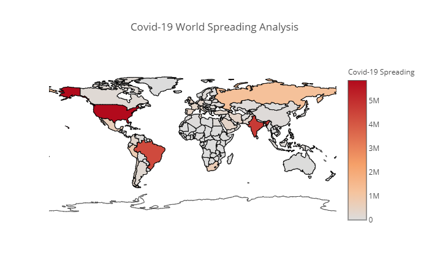

# Analysis-for-Covid-19-Spreading
## Analysis 
#### Libraries i used To make the analysis 
1. numpy 
2. pandas to make Dataframes 
3. Matplotlib & Plotly for visualizations

#### I used Anaconda (Jupyter Notebook) to make it much clear 
How to install the Libraries ?
pip install pandas
conda install pandas
pip install numpy
conda install numpy
pip install matplotlib 
conda install matplotlib 
pip install plotly
cpnda install plotly

# Dataset
Dataset i used was a much bigger dataset with lots of columns that i didn't need so i used pandas to mainapulate, clean and updating it.

I made my new dataset you can check it in the link below
https://www.kaggle.com/mohamedhanyyy/covid19-worldspreading

I wanted to Collect all the Covid-19 cases all over the world and make analysis on it
Data is simple but can bring a lot of insights

Data is classified into 4 columns
(Country/Region', 'Confirmed', 'Country Abbr 2', 'Country Abbr 3)

1. Country/Region contain all world Countries
2. Confirmed contain all confirmed Covid-19 cases
3. Country Abbr 2 contain every country with the abbreviation of 2 letter
4. Country Abbr 3 contain every country with the abbreviation of 3 letter

## Visualizations
matplotlib & plotly support many graphs
World map (choropleth) made it easy to understand the spreading analysis of covid-19

# Result 
Understanding how covid-19 affected countries all over the world by some easy analysis  
